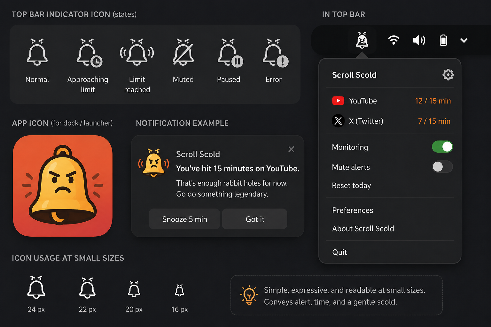

# Scroll Scold 🔔😠

A GNOME Shell extension that scolds you when doomscrolling sites steal too much of your time.



Scroll Scold sits in your top bar as an angry little bell. When you spend too long **actively** on a social media site — in any browser, any Chrome profile — it rings: a notification ("You've hit 15 minutes on YouTube. That's enough rabbit holes for now.") plus a scolding chime.

## Features

- **Top-bar indicator** with six states: normal, approaching limit (≥80%), limit reached, muted, paused, and error.
- **Popup menu** showing today's time per platform ("YouTube — 12 / 15 min") with a colored monogram badge per platform (custom hex color per platform, or automatic), Monitoring and Mute alerts toggles, Reset today, Preferences, and About.
- **Active-use timing**: the timer for a platform runs only while its tab is focused. Quick tab-flicks can't dodge the scold (a configurable grace period, default 60 s, must pass before the session resets), but genuinely leaving the site does reset it. Repeated short visits never add up to a false scold.
- **Idle-aware**: no keyboard/mouse input (default 60 s) pauses the timers.
- **Notification with actions**: *Snooze* (configurable, default 2 min) re-scolds shortly after if you're still there; *Got it* waits a full threshold before scolding again.
- **Sound**: ships with a built-in scold chime; point it at your own audio file in Preferences.
- **Multiple platforms**: YouTube, X (Twitter), Facebook, Instagram, TikTok, and Reddit are preconfigured; add or edit your own with title keywords.
- **One global threshold** in minutes (default 15).

## How it works (and why it's a shell extension)

GNOME on Wayland deliberately prevents ordinary apps from seeing other apps' windows — only the compositor (GNOME Shell itself) knows what's focused. Scroll Scold therefore runs *inside* the shell as an extension: it reads the focused window's title (e.g. `cat videos - YouTube — Google Chrome`) and matches it against per-platform keywords. This works across **all browsers and all browser profiles** with zero per-browser setup, and it only ever sees the *active* tab — which is exactly the "actively using" behavior you want. Matching is gated to known browser windows (by window class) so a code editor with `youtube-player.js` open doesn't count.

## Install

Requires GNOME Shell 46–50 (Ubuntu 24.04 LTS or newer).

```bash
git clone https://github.com/BlackEyedHatMan/scroll-scold.git
cd scroll-scold
make install
```

Then log out and back in (Wayland can't hot-restart the shell), and enable it:

```bash
gnome-extensions enable scroll-scold@blackeyedhatman.com
```

Open settings with the bell menu's **Preferences** (or `gnome-extensions prefs scroll-scold@blackeyedhatman.com`).

## Configuration

| Setting | Default | Meaning |
|---|---|---|
| Time limit | 15 min | Continuous active minutes on a platform before you get scolded |
| Snooze duration | 2 min | How long the notification's Snooze button delays the next scold |
| Grace period | 60 s | Time away from a platform before its session timer resets to zero |
| Idle pause | 60 s | No input for this long pauses the timers |
| Platforms | YouTube, X, Facebook, Instagram, TikTok, Reddit | Editable; keywords match the tab title. End a keyword with `$` to require it at the end of the title (X uses `/ x$` so a bare "x" can't match everything) |
| Browser identifiers | chrome, chromium, firefox, brave, edge, opera, vivaldi, librewolf, zen, epiphany | Substring-matched against the focused window's class — Chrome profile windows ("google-chrome (Profile 1)") are covered |

Today's usage is stored in `~/.local/state/scroll-scold/usage.json` and resets at midnight (or via **Reset today**).

## Development

```bash
make test      # unit tests for the matcher and timer engine (plain gjs, no shell needed)
make pack      # build dist/scroll-scold@blackeyedhatman.com.shell-extension.zip
make install   # pack + install to ~/.local/share/gnome-shell/extensions
make nested    # nested GNOME Shell session for interactive testing
```

Logs: `journalctl -f -o cat /usr/bin/gnome-shell` (shell side), `journalctl -f -o cat /usr/bin/gjs` (preferences side). Messages are prefixed `[scroll-scold]`.

The core logic (`src/lib/matcher.js`, `src/lib/sessionEngine.js`) is pure JavaScript with no GNOME imports, so it runs — and is tested — under plain `gjs -m`.

## Known limitations (v1)

- Title matching can rarely false-positive (e.g. a page or document literally titled "YouTube something" in a browser window). Browser gating keeps non-browser apps out.
- Hands-free video watching generates no input, so the idle pause can under-count it. Raise **Idle pause** if that bothers you.
- X/Twitter changes its title format now and then; the match rules are user-editable data, not code, so you can fix them in Preferences.
- Browser PWAs (`crx_…` windows) don't pass the browser gate by default; add `crx_` to the browser identifiers if you want them counted.
- The extension is inactive on the lock screen (by design — you can't scroll there anyway).

## License

See [LICENSE](LICENSE).
